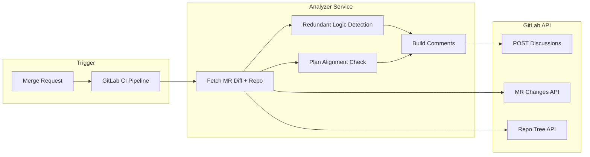
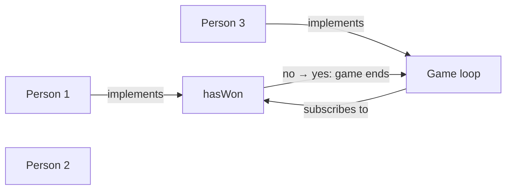

# AI-Powered GitLab Code Review Assistant – Implementation Plan

## Architecture Overview




- **Trigger**: GitLab pipeline runs on `merge_request_event` (every push to an MR branch).
- **Analyzer**: Single service (script or container) that (1) fetches MR diff and repo context, (2) runs redundancy and architecture checks, (3) builds and posts comments.
- **GitLab APIs**: [MR changes](https://docs.gitlab.com/ee/api/merge_requests.html#get-single-merge-request-changes) for diff, [repository tree](https://docs.gitlab.com/ee/api/repositories.html) for “rest of codebase,” [Discussions API](https://docs.gitlab.com/ee/api/discussions.html) to create MR threads (optionally with `position` for inline diff comments).

---

## 1. GitLab Integration

### 1.1 CI/CD pipeline

- **MR analysis job** (runs only on merge requests): Add a job in `.gitlab-ci.yml` with `rules: - if: $CI_PIPELINE_SOURCE == "merge_request_event"`. It receives `CI_PROJECT_ID`, `CI_MERGE_REQUEST_IID`, `CI_COMMIT_SHA`, etc., runs the analyzer (redundancy + architecture), and posts MR comments.
- **Team status job** (runs on push to default branch): A second job with `rules: - if: $CI_PIPELINE_SOURCE == "push" && $CI_COMMIT_BRANCH == "main"` (or your default branch) that (1) fetches recent commits/merged MRs, (2) attributes changes to people and maps them to tasks, (3) regenerates `docs/team-flow.md`, `docs/team-status.json`, and per-person “my work” docs, (4) commits and pushes these generated files so everyone sees updated “what I’ve done” and flowchart. Requires CI token with `write_repository` to push.
- Use a [project or group access token](https://docs.gitlab.com/ee/user/project/settings/project_access_tokens.html) (stored as CI variable `GITLAB_TOKEN`) with scopes: `api`, `read_repository`, `write_repository` (or minimal needed for MR discussions + status push).

### 1.2 API usage


| Need                                   | Endpoint / approach                                                                                                                                                          |
| -------------------------------------- | ---------------------------------------------------------------------------------------------------------------------------------------------------------------------------- |
| Changed files + diff                   | `GET /projects/:id/merge_requests/:merge_request_iid/changes`                                                                                                                |
| MR version (for diff comment position) | `GET /projects/:id/merge_requests/:merge_request_iid/versions` (take latest; use `base_sha`, `head_sha`, `start_sha` for `position`)                                         |
| Rest of codebase (for redundancy)      | `GET /projects/:id/repository/tree?recursive=true&ref=...` then `GET /projects/:id/repository/files/:path/raw?ref=...` for relevant files (e.g. by extension or path filter) |
| Post comment (general)                 | `POST /projects/:id/merge_requests/:merge_request_iid/discussions` with `body`                                                                                               |
| Post inline comment                    | Same endpoint with `position` (base_sha, head_sha, start_sha, position_type, new_path, old_path, new_line/old_line)                                                          |


- **Rate/scale**: For large repos, limit “rest of codebase” to certain paths (e.g. `game/`, `ui/`) or file types to keep runs fast and within API limits.

### 1.3 GitLab hosting: GitLab.com vs self-managed


|              | GitLab.com                                            | Self-managed                                                |
| ------------ | ----------------------------------------------------- | ----------------------------------------------------------- |
| **Setup**    | No server; create project, add CI variables, done.    | You run GitLab; need URL, often custom SSL and auth.        |
| **API base** | `https://gitlab.com/api/v4` (fixed).                  | Your base URL (e.g. `https://gitlab.mycompany.com/api/v4`). |
| **Tokens**   | Project/group/personal access tokens from gitlab.com. | Same API; tokens from your instance.                        |
| **CI**       | Shared runners available; no ops.                     | Your runners; you maintain them.                            |
| **Best for** | Hackathons, open source, small teams, quick demo.     | Enterprise, air-gapped, strict data residency.              |


- **Recommendation**: Use **GitLab.com** for the hackathon (fastest path, no infra). If you later need self-managed, the same code works with a configurable `GITLAB_BASE_URL` (default `https://gitlab.com`).
- **Testing on a solo project**: You can test the full flow with one person. Create a feature branch, push code, open an MR to `main`. The pipeline runs on that MR and posts comments; you review and merge when ready.

---

## 2. Redundant Logic Detection

**Goal**: Find functions (or logical blocks) in the MR that are semantically similar to existing code and suggest reuse.

### 2.1 Extract code units from MR and codebase

- **MR side**: From `changes[]` per file, parse only added/changed content (or full file if easier); extract functions/methods/modules.
- **Codebase side**: From repo tree, fetch files (e.g. same language as changed files), parse and extract functions.
- **Parsing**: Use AST-based extraction so you get named functions and approximate boundaries. **MVP: JavaScript/TypeScript only** (tree-sitter or Esprima; collect `FunctionDeclaration` / `FunctionExpression` and their ranges). Python or other languages can be added later.
- **Output**: List of “code units” with: `file`, `name` (if any), `start_line`, `end_line`, `source_text`, optional `normalized_ast` or signature.

### 2.2 Similarity detection

Two complementary approaches (pick one for MVP, or combine):

- **Option A – Embeddings + vector similarity**
  - Generate embeddings for each unit’s source (or normalized form) using a code-capable model.
  - For each new unit in the MR, compare against embeddings of existing units (cosine similarity or ANN). Threshold (e.g. > 0.85) → “possible duplicate.”
- **Option B – LLM-based**
  - Send pairs (new snippet, existing snippet) to an LLM with a prompt: “Do these implement the same or very similar logic? Yes/No and brief reason.” Use for a small candidate set to avoid cost.
- **Hybrid (recommended)**
  - Use **Voyage API** for embeddings (cost-effective; see Technology Choices below) to get top‑k candidates per new function; then **OpenRouter (free model)** to decide “duplicate / suggest reuse” and to generate the exact suggestion text.

### 2.3 Mapping back to MR and building comments

- For each “redundant” pair (new unit, existing unit): attach `file`, `new_line` (and optionally `end_line`) from the MR diff.
- Fetch MR versions to get `base_sha`, `head_sha`, `start_sha` for the target file.
- Build one discussion per finding (or batch in one thread): `POST .../discussions` with `body` = suggestion and, when possible, `position` so the comment appears on the right line in the diff.

---

## 3. Plan & Architecture Alignment

**Goal**: Flag when code lives in the wrong module or conflicts with a stated plan (e.g. “win logic belongs in game/core, not ui”).

### 3.1 Project plan schema (JSON/YAML)

Define a small schema the team maintains (e.g. `docs/architecture-plan.yaml` or `.gitlab/architecture-plan.json`):

- **Modules**: List of modules with `name`, `path` (e.g. `game/core`), optional `description` and `responsibilities` (short list).
- **Rules**: Optional list of rules, e.g. “win detection logic belongs in module `game/core`” or “files under `ui/` must not contain game state logic.”
- **Assignments** (optional): Map modules or areas to owners for “Person A already implemented X” style messages.

Example (YAML):

```yaml
modules:
  - name: game-core
    path: game/core
    responsibilities: [ "win/loss detection", "game state", "rules" ]
  - name: ui
    path: ui
    responsibilities: [ "presentation", "user input" ]
rules:
  - description: "Win detection logic belongs in game-core"
    keywords: [ "win", "victory", "hasWon", "checkVictory" ]
    allowed_modules: [ game-core ]
```

### 3.2 Detection logic

- **Location check**: For each changed/added file, map its path to a module (by `path` prefix). If the file’s path doesn’t match any module or matches a “wrong” one, flag.
- **Intent vs responsibility**: For each extracted function (from step 2.1), optionally:
  - Use keywords/heuristics from `rules` (e.g. name contains “win”, “victory”) or
  - Use a small LLM call: “Which module should own this logic: game-core or ui?” and compare with the file’s current module.
- **Conflict message**: If a rule says “win detection → game-core” but the code is in `ui/winChecker.js`, generate: “Logic for win detection appears outside the intended module; recommended location: game/core.”

### 3.3 Posting architecture findings

- Same Discussions API: one thread per finding (or a summary thread). Optionally add `position` on the first line of the offending file/function so the comment is inline.

---

## 4. Team Plan, Role Descriptions & Change Workflow

**Goal**: Every team member has a single, always-visible description of their work (what they own, what they deliver, what they use from others). Changes to the plan go through an AI-assisted, teammate-approved flow so the plan stays the source of truth. This is **project-agnostic**: same schema works for games, APIs, services, or full products.

### 4.1 Schema: roles, tasks, and dependencies

Extend the project plan (or add a separate `docs/team-plan.yaml`) with:

- **People/roles**: Each person (or role) has an id, display name, and optional GitLab username for linking.
- **Tasks/deliverables**: Each task has an id, short title, owner (person/role), module/path, and a one-line description (e.g. “hasWon() used by game loop” or “Auth API consumed by dashboard”).
- **Dependencies**: Explicit “consumes” / “used by” links: e.g. “Person 3’s game loop subscribes to Person 1’s hasWon(); when it changes no→yes, game ends.” Stored as `consumer` → `provider` + optional behavior note.

Example (generic YAML):

```yaml
# Works for any project: game, API, app, service
people:
  - id: person1
    name: "Dev 1"
    gitlab_username: dev1
  - id: person2
    name: "Dev 2"
tasks:
  - id: t1
    title: "Win-state function"
    owner: person1
    module: game-core
    description: "Exposes hasWon() used by game loop; when it flips to true, game ends."
  - id: t2
    title: "Game loop"
    owner: person3
    module: game-core
    description: "Subscribes to win state; ends game when hasWon() becomes true."
dependencies:
  - provider: t1
    consumer: t2
    note: "Subscribes to hasWon(); game ends on no → yes."
```

- **Where it lives**: Committed in repo (e.g. `docs/team-plan.yaml`) so it’s always visible and versioned. Optional: also render in a small dashboard or GitLab Wiki page.

### 4.2 Always-visible “what I do / what others do”

- **Per-person view**: From the plan, generate a simple text or markdown summary per person: “Your work: …”, “You consume: …”, “Others consume from you: …”. This can be:
  - A generated `docs/my-work-<person>.md` (e.g. in CI or a script), or
  - A dashboard panel that shows the same for the logged-in user.
- **Single source of truth**: All “who does what” and “how it connects” comes from `team-plan.yaml` (+ architecture-plan for modules). No duplicate docs.

### 4.3 Auto-update from Git: “what I’ve done” and status for everyone

**Goal**: When anyone pushes code (or merges an MR), the system infers what’s been done, attributes it to that person, and regenerates the team view so everyone sees an updated “what I do / what I’ve done” and an updated flowchart without manual edits.

- **Derive “done” from Git**:
  - Use GitLab API: commits on default branch (or merged MRs), with **author** (GitLab username or email) to attribute work to a person in `team-plan.yaml` (match via `gitlab_username` or configured email).
  - Map commits/changes to **tasks**: by **file path** (task has `module`/path; if commit touches files under that module, associate with that task), and optionally by **branch name** or **MR title** (e.g. “feat/hasWon” → task “Win-state function”). If a task has a `path` or `module` that corresponds to repo paths, consider the task “done” when there are merged changes under that path by the task owner (or any merge that touches it and is attributed).
  - Store derived state in a small **status file** (e.g. `docs/team-status.json` or generated section in `team-flow.md`): per task, “done: true/false” and optional “last_updated” / “last_commit” / “by whom.” Do **not** overwrite `team-plan.yaml` with this—keep plan as the canonical “what should be done”; the status file is generated and committed or published so everyone sees it.
- **Mapping tasks to repo paths**: Each task’s `module` (e.g. `game-core`) is resolved to a repo path via `architecture-plan.yaml` (e.g. `path: game/core`). Commits that touch files under that path and are authored by the task’s owner (GitLab username match) count toward that task being “done.” Optional: task can specify `path` or `paths` directly for more precise matching.
- **When to regenerate**:
  - **On push to default branch** (e.g. `main`): CI job “Update team status” runs: fetch recent commits (or merged MRs), attribute to people, match to tasks, regenerate `docs/team-flow.md`, `docs/team-status.json`, and per-person “what I do / what I’ve done” (including “Done” vs “To do” per task). Then **commit and push** these generated files back to the repo (using CI token with write access), or publish to dashboard/wiki.
  - **On merge request merge**: Same job can run when an MR is merged (e.g. pipeline on `main` after merge) so the moment code lands, the team view updates for everyone.
- **What everyone sees**:
  - **Flowchart** and **“how it works”** text stay in sync with the plan; the same diagram can show status (e.g. “Person 1 → hasWon() ✓” vs “Person 2 → API (in progress)”).
  - **Per-person page** (e.g. `docs/my-work-person1.md` or dashboard): “Your work” (from plan) + “What you’ve done” (from Git: e.g. “t1: Win-state function – done (merged in MR !5)”, “t2: Game loop – to do”). So when one person pushes, their “done” list and the shared chart update for everyone.
  - Optional: **notify** (e.g. MR comment or Slack) when status changes (“Dev 1 completed task Win-state function; Dev 3’s Game loop can now integrate.”).

### 4.4 Propose change → AI → teammate approval (defer for hackathon MVP)

- **Flow** (for later): Someone describes a plan change in plain language → AI suggests YAML diff → teammates approve → plan updates.
- **Effort and complexity**:
  - **Easiest (issue/MR-only)**: User posts proposal in a GitLab issue or MR description; a bot or manual step calls OpenRouter with current plan + proposal, posts the suggested YAML diff as a comment; someone copies into `team-plan.yaml` and merges. **Rough effort: 1–2 days** (OpenRouter client + prompt + GitLab comment posting). Complexity: low.
  - **Dashboard “Propose” form**: Form in dashboard → call OpenRouter → show diff → “Approve” creates an MR (or commits with token). **Rough effort: 2–3 days** (dashboard UI + auth/permissions + GitLab API to create MR/commit). Complexity: medium.
- **Recommendation**: **Skip propose-change for the hackathon** if the priority is production-quality MR comments, flowchart, and auto status. Implement it after: it’s the most complex workflow piece and not required for the “who does what / what’s done” demo. If you add it, the **issue/MR-only** option is the fastest and least fragile.

### 4.5 Real-world / hackathon applicability

- **Generic schema**: Roles, tasks, and dependencies are not game-specific. Same format describes “Backend owns /auth; Frontend consumes /auth” or “Person A: payment service; Person B: order service that calls payment.”
- **Impressiveness**: Shows the AI both enforcing the plan (in MR comments) and helping evolve it (propose → suggest → approve), with a clear audit trail in Git.

---

## 5. Live Flowchart & Dependency Chart

**Goal**: One simple, easy-to-understand diagram that shows who does what, what’s done vs to-do, and how pieces connect so anyone can see how the system works. Generic and auto-generated from the team plan (and optionally from repo state).

### 5.1 What the chart shows

- **People → deliverables**: e.g. “Person 1 → hasWon()”, “Person 2 → API”, “Person 3 → game loop”.
- **Data/control flow**: “Person 3’s game loop uses Person 1’s hasWon(); when it changes no→yes, game ends.”
- **Status (optional)**: “To do” vs “Done” per task (inferred from plan: e.g. “implemented” flag, or from GitLab: branch/MR exists for that module).

### 5.2 Format and generation

- **Format**: **Mermaid** flowchart or similar (good in GitLab, Markdown, and dashboards). Alternative: simple node-link JSON for a custom dashboard renderer.
- **Generation**: Script (Python) reads `team-plan.yaml` (+ optional `architecture-plan.yaml`) and emits:
  - A **flowchart**: nodes = people and/or tasks; edges = “implements”, “uses”, “subscribes to” with short labels.
  - Optionally a **summary table**: columns = Person | To do | Done | Consumes from | Consumed by.

Example Mermaid (generic):




- **Where it lives**: 
  - **In repo**: e.g. `docs/team-flow.md` (Mermaid block) or `docs/team-flow.mmd`; regenerated on CI or when plan changes (or manually).
  - **In dashboard**: Same Mermaid or a chart lib (e.g. D3, React Flow) for an interactive view.

### 5.3 “How the system works” one-pager

- From the same data, generate a short **narrative** (or bullet list): “Person 1 provides hasWon(). Person 3’s game loop subscribes to it; when it flips to true, the game ends. Person 2 ….” This can sit above the flowchart in `docs/team-flow.md` or in the dashboard. Keeps the diagram grounded and usable for any project type.

---

## 6. Actionable Feedback in GitLab

- **Comment format**: Keep each comment short and actionable:
  - Redundancy: “`checkVictory()` overlaps with `gameEngine.hasWon()` in game/core. Consider reusing existing logic.”
  - Architecture: “`winChecker.js` implements logic outside its intended module; recommended location: game/core.”
- **Where to post**:
  - **Inline**: Use `position` when you have exact file and line from the diff (best for “this function” feedback).
  - **General**: If position is hard (e.g. multi-file summary), post without `position` so it appears as a thread on the MR.
- **Idempotency**: To avoid duplicate comments on re-runs, either:
  - Delete previous bot discussions before posting (list discussions, filter by bot user, delete), or
  - Add a unique marker in the body and skip posting if a note with that marker already exists.

---

## 7. Dashboard (in scope for hackathon)

- **Goal**: Simple dashboard for team leads: flowchart, team status (“what I do / what I’ve done”), and optional metrics. **In scope** per clarification.
- **Data**: Generated files in repo (`team-flow.md`, `team-status.json`, `my-work-*.md`) can be read by the dashboard; optionally store MR run results in a small DB or append-only store (e.g. SQLite) for “redundancy/alignment this week” metrics.
- **API**: Small HTTP API (e.g. Flask or FastAPI) that (1) serves or proxies the generated plan/flow/status (from repo or local files), (2) optionally returns per-MR or per-project aggregates.
- **UI**: Simple single-page view: Mermaid flowchart (rendered with mermaid.js or similar), table or cards for per-person “to do / done” and “consumes / consumed by,” optional list of recent MRs with finding counts. Can be static HTML + fetch or a minimal React/Vue app; host on GitLab Pages or run alongside the API.
- **Scope**: No “propose change” form in MVP (see 4.4); focus on read-only view of plan + status + flowchart.
- **Hosting**: **GitLab Pages** – dashboard is a static site (HTML + JS + fetch) from the same repo, published to Pages.

---

## 8. Technology Choices

**Stack: Python, Voyage (embeddings), OpenRouter (LLM).**


| Layer          | Choice                                                                                                           | Notes                                                                                                                                                                                                                                                                  |
| -------------- | ---------------------------------------------------------------------------------------------------------------- | ---------------------------------------------------------------------------------------------------------------------------------------------------------------------------------------------------------------------------------------------------------------------- |
| Runtime        | **Python 3.11+**                                                                                                 | As requested.                                                                                                                                                                                                                                                          |
| CI runner      | GitLab shared runner or self-hosted                                                                              | —                                                                                                                                                                                                                                                                      |
| GitLab client  | `python-gitlab` or `requests`                                                                                    | —                                                                                                                                                                                                                                                                      |
| AST / parsing  | **tree-sitter** (multi-language) or language-specific (e.g. `esprima` for JS, `ast` for Python)                  | —                                                                                                                                                                                                                                                                      |
| **Embeddings** | **Voyage API**                                                                                                   | Low cost: free tier (e.g. 200M tokens); `voyage-4-lite` ~$0.02/1M tokens. Use `voyage-code-2` or `voyage-code-3` for code-specific embeddings if needed. **Fallback**: `sentence-transformers` (e.g. `all-MiniLM-L6-v2`) for zero cost, slightly lower code relevance. |
| **LLM**        | **OpenRouter** (free model)                                                                                      | Use `openrouter/free` (auto-selects free model) or a specific free model (e.g. `meta-llama/llama-3.2-3b-instruct:free`). Rate limits: ~20 req/min, 200/day – fine for hackathon/demo. For “is duplicate?” and suggestion text only.                                    |
| Config         | YAML or JSON for plan + team schema; env/CI variables for `GITLAB_TOKEN`, `VOYAGE_API_KEY`, `OPENROUTER_API_KEY` | —                                                                                                                                                                                                                                                                      |


- **Secrets**: Store `GITLAB_TOKEN`, `VOYAGE_API_KEY`, and `OPENROUTER_API_KEY` in GitLab CI/CD variables (masked). Never commit them.

### 8.1 Budget check: best choices for low budget

**Verdict: Voyage + OpenRouter are among the best options for your constraints.** Below are the comparison and fallbacks so you can stay near-zero cost.

**Embeddings**


| Option                        | Cost                                                                | Free tier                                                                          | Code quality                               | Best for                                                                                                                                |
| ----------------------------- | ------------------------------------------------------------------- | ---------------------------------------------------------------------------------- | ------------------------------------------ | --------------------------------------------------------------------------------------------------------------------------------------- |
| **Voyage API** (your choice)  | After free: ~$0.02/1M (voyage-4-lite), ~$0.06–0.18/1M (code models) | **200M tokens** per account (general); **50M** for code-specific (voyage-code-2/3) | Very good; code models best for code       | **Recommended**: huge free bucket, then cheap; code models available.                                                                   |
| Sentence-transformers (local) | **$0**                                                              | Unlimited (runs on your machine/CI)                                                | Good for similarity, weaker on code intent | **$0 fallback**: no API key; add `sentence-transformers` to CI; use e.g. `all-MiniLM-L6-v2` or `paraphrase-multilingual-MiniLM-L12-v2`. |
| Google Gemini embeddings      | Free tier available                                                 | ~1,000–1,500 req/day (varies)                                                      | General-purpose                            | Zero cost but daily limit may cap you on many MRs.                                                                                      |
| OpenAI text-embedding-3-small | ~$0.02/1M                                                           | No free tier                                                                       | Good                                       | Only if you already have credits; no free tier.                                                                                         |


- **Recommendation**: Keep **Voyage** as primary. For a hackathon you will likely stay within 200M free tokens. If you want to avoid any API cost, add a **fallback** to **sentence-transformers** in CI (same interface, switch via env var); quality is slightly lower but usually sufficient for “similar function?” ranking.

**LLM (duplicate check + suggestion text)**


| Option                       | Cost            | Free limits                                                                     | Best for                                                                                                                                           |
| ---------------------------- | --------------- | ------------------------------------------------------------------------------- | -------------------------------------------------------------------------------------------------------------------------------------------------- |
| **OpenRouter** (your choice) | Free models: $0 | **20 RPM, 200 requests/day** (free model variants)                              | **Recommended**: one API for many free models; 200/day is enough for “is duplicate?” + suggestion text per MR (handful of calls per pipeline run). |
| Groq                         | Free tier       | 30 RPM, 14.4K RPD (example for one model); hackathons can request higher limits | Good **fallback** if you hit OpenRouter’s 200/day; direct API, fast.                                                                               |
| Google Gemini                | Free tier       | ~5–15 RPM, ~1K req/day                                                          | Alternative; same use case.                                                                                                                        |


- **Recommendation**: **OpenRouter** is a strong fit: unified API, many free models, 200/day is enough for typical MR volume. If you hit limits (e.g. many MRs in one day), add **Groq** as secondary (or use Groq for the LLM step and keep OpenRouter for flexibility). No need to switch unless you see 429s.

**Summary**

- **Voyage**: Best value for embeddings (large free tier, then low $/1M). Optional: support sentence-transformers as $0 fallback.
- **OpenRouter**: Best fit for free LLM at low volume; add Groq or Gemini only if you exceed 200 requests/day.
- Your current choices are **optimal for low budget**; the table above gives you clear fallbacks if you need $0 or higher free limits.

---

## 9. Repo Structure (suggested)

```
.gitlab-ci.yml
docs/
  architecture-plan.yaml
  team-plan.yaml          # Roles, tasks, dependencies (single source of truth)
  team-flow.md            # Generated: Mermaid flowchart + “how it works” + status
  team-status.json        # Generated: per-task done/to-do, last commit, by whom
  my-work-<person>.md     # Generated per person: what I do + what I’ve done
src/
  gitlab_client.py        # GitLab API: MR changes, tree, discussions
  extractors/             # AST extraction per language
    base.py
    javascript.py
    python.py
  redundancy/             # Voyage embeddings + OpenRouter LLM
    embeddings.py         # Voyage API client
    detector.py
  architecture/          # Plan load + rules + module check
    plan_loader.py
    aligner.py
  team_plan/              # Team plan & change workflow
    team_plan_loader.py   # Load team-plan.yaml, validate
    flowchart.py         # Generate Mermaid + summary from plan
    status_from_git.py   # Derive "done" from commits/MRs, attribute to people, map to tasks
    propose_change.py    # AI-assisted plan change suggestion (OpenRouter)
  feedback/
    formatter.py
    poster.py
  pipeline.py
requirements.txt
README.md
```

---

## 10. Demo Scenario (Judges)

- **Demo repo**: Use an **existing real project** (per clarification). Ensure it has (or add) `docs/architecture-plan.yaml` and `docs/team-plan.yaml` so the analyzer and flowchart have a plan to align to.
- To replicate your described demo (game example; same flow works for APIs, services, or any product):

1. **Setup**: In that repo, add or adjust:
  - `docs/architecture-plan.yaml`: “win detection” in `game/core`; `ui` for presentation only.
  - `docs/team-plan.yaml`: Person 1 → hasWon(); Person 3 → game loop that subscribes to hasWon(); dependency “no→yes → game ends.”
  - Existing `game/core/winnerLogic.js` with `hasWon()`.
2. **Developer 1**: Add `ui/winChecker.js` with `hasWon()` (or similar).
3. **Developer 2**: Add `game/core/winnerLogic.js` with `checkVictory()` that duplicates logic.
4. **MR**: Pipeline runs the analyzer.
5. **Expected comments**:
  - On `checkVictory()`: “Overlaps with `hasWon()` in game/core. Consider reusing existing logic.”
  - On `ui/winChecker.js`: “Implements logic outside intended module; recommended location: game/core.”
6. **Flowchart**: `docs/team-flow.md` shows e.g. Person 1 → hasWon() → used by Person 3’s game loop; regenerated from `team-plan.yaml`.
7. **Talking points**: Real-world applicable; AI enforces and helps evolve the plan; clear chart of who does what and how it connects; low cost (Voyage + OpenRouter free).

---

## 11. Implementation Order

1. **GitLab client** – Fetch MR changes and MR versions; post a simple test discussion (no position).
2. **AST extractors** – Extract functions from JS (and optionally Python) for MR diff and for a small set of repo files.
3. **Redundancy MVP** – Voyage embeddings for “new” vs “existing” functions; threshold; OpenRouter (free) for “is duplicate?” and suggestion text; one summary comment first.
4. **Architecture plan** – Load YAML, map paths to modules, keyword/heuristic rule check; post architecture comments.
5. **Team plan & flowchart** – Load `team-plan.yaml`; generate `docs/team-flow.md` (Mermaid + short “how it works” summary); optional per-person “my work” view.
6. **Auto-update “what I’ve done”** – Implement `status_from_git.py`: fetch commits/MRs, attribute by GitLab user, map changed paths to tasks via module→path; regenerate `team-status.json`, flowchart, and per-person docs on push to default branch; CI job that commits generated files so everyone sees updates when code is pushed.
7. **Inline comments** – Compute `position` from MR versions and post redundancy/architecture findings as diff notes.
8. **Dashboard** – Read-only view: serve flowchart (Mermaid), team status, per-person “my work”; optional MR metrics. (Propose-change flow deferred.)

This order gets you to a working, hackathon-impressive demo: steps 1–7 cover MR comments and auto-updating status/flowchart; step 8 adds the read-only dashboard. Propose-change is deferred to keep the hackathon scope production-quality.

---

## 12. Step-by-step build order (best practices)

Build in small, testable increments. **Tests early**: add pytest (or equivalent) for each component as you build it. **Analyzer runs in CI only** (no local CLI for MVP). **Dashboard**: static site for GitLab Pages. Each phase ends with a clear "done when" so you don’t move on until it’s verified.

### Phase 1: Foundation (repo + GitLab client + CI job)

- **1.1** Create project layout: `src/`, `docs/`, `tests/`, `requirements.txt`, `.gitlab-ci.yml` stub. Add `docs/architecture-plan.yaml` and `docs/team-plan.yaml` with minimal examples (one module, one person, one task).
- **1.2** Implement GitLab client: fetch project MR changes (`/projects/:id/merge_requests/:iid/changes`), fetch MR versions (`/.../versions`), create discussion (`POST .../discussions` with `body`). Use env: `GITLAB_BASE_URL`, `GITLAB_TOKEN`, `CI_PROJECT_ID`, `CI_MERGE_REQUEST_IID` (from CI).
- **1.3** Write tests: mock GitLab API responses; test that client returns parsed changes and can build a discussion payload. No real API calls in tests.
- **1.4** Add CI job: one job that runs on `merge_request_event`, installs deps, runs `python -m src.pipeline` (or a small script that only calls the client and posts one test comment: "Analyzer ran."). Verify: push branch, open MR, see the comment.
- **Done when**: MR pipeline runs and one test comment appears on the MR. GitLab client is tested and used from CI.

### Phase 2: AST extractors (JavaScript/TypeScript only)

- **2.1** Implement `extractors/base.py`: interface for "extract code units from source" (returns list of `{file, name, start_line, end_line, source_text}`).
- **2.2** Implement `extractors/javascript.py`: use tree-sitter (or Esprima) to parse JS/TS, walk AST, collect function declarations/expressions; implement `base` interface.
- **2.3** Write tests: feed a string with 2–3 functions, assert correct count and line ranges; test edge cases (nested functions, arrow functions).
- **2.4** Integrate in pipeline: from MR changes, for each changed `.js`/`.ts` file, get raw content (from changes or file API), run extractor, pass list of units to next step. Log or post count of "found N functions in MR."
- **Done when**: Pipeline run on an MR that touches JS files posts a comment like "Found 5 functions in changed files." Extractor tests pass.

### Phase 3: Redundancy detection (Voyage + OpenRouter)

- **3.1** Implement `redundancy/embeddings.py`: call Voyage API for a list of strings; return vectors. Use env `VOYAGE_API_KEY`. Handle errors and rate limits.
- **3.2** Write tests: mock Voyage response; test that given N strings you get N vectors of expected dimension.
- **3.3** Implement `redundancy/detector.py`: for each "new" unit from MR, get embedding; fetch "existing" units from repo (tree + raw files for same extensions), get embeddings; cosine similarity, keep top-k; call OpenRouter with pairs "are these duplicates?" and get suggestion text. Use env `OPENROUTER_API_KEY`.
- **3.4** Write tests: mock embeddings and OpenRouter; test that detector returns a list of findings with (new_unit, existing_unit, suggestion_text).
- **3.5** Integrate in pipeline: run detector on MR units vs repo units; collect findings; pass to feedback step. Post one **summary** comment listing redundancy suggestions (no inline yet).
- **Done when**: MR that introduces a duplicate function gets a summary comment like "Found 1 redundancy: consider reusing X." Redundancy tests pass.

### Phase 4: Architecture alignment

- **4.1** Implement `architecture/plan_loader.py`: load `docs/architecture-plan.yaml` (modules with path, rules with keywords/allowed_modules). Validate and return structured config.
- **4.2** Implement `architecture/aligner.py`: for each changed file path and extracted units, resolve module by path prefix; check rules (e.g. keyword in function name → must be in allowed module). Return list of violations (file, message).
- **4.3** Write tests: mock plan; test aligner flags file in wrong path and allows file in correct path.
- **4.4** Integrate in pipeline: run aligner on MR changes + plan; post one comment with architecture findings (or append to summary).
- **Done when**: MR that adds "win" logic under `ui/` gets an architecture comment. Aligner tests pass.

### Phase 5: Team plan & flowchart

- **5.1** Implement `team_plan/team_plan_loader.py`: load `docs/team-plan.yaml` (people, tasks, dependencies). Validate and return structured data.
- **5.2** Implement `team_plan/flowchart.py`: from plan, generate Mermaid diagram (people → tasks, tasks → dependencies) and a short "how it works" text. Write to `docs/team-flow.md` (content only; don’t commit yet).
- **5.3** Write tests: given a minimal plan YAML, assert generated Mermaid contains expected nodes/edges.
- **5.4** Add a **separate CI job** that runs on push to `main`: run flowchart generator, then commit+push `docs/team-flow.md` (use token with write). Or: run only in MR pipeline and commit in a "merge" hook—simplest is "on push to main, regenerate and push."
- **Done when**: Pushing to main updates `docs/team-flow.md` with correct Mermaid. Flowchart tests pass.

### Phase 6: Status from Git ("what I’ve done")

- **6.1** Implement `team_plan/status_from_git.py`: fetch commits on default branch (or merged MRs) via GitLab API; attribute by author (match to `team-plan` people by gitlab_username); for each commit, get changed paths; map paths to tasks via module→path from architecture plan; produce `team-status.json` (per task: done true/false, last_commit, by_whom) and per-person "my work" markdown.
- **6.2** Write tests: mock commit list and changed files; assert status marks the right tasks done for the right people.
- **6.3** In the same "on push to main" job, run status_from_git, then write `docs/team-status.json` and `docs/my-work-<person>.md`; update `docs/team-flow.md` to include status in diagram or table; commit and push all.
- **Done when**: After merging an MR, the next push to main updates team-status and my-work docs; flowchart shows done/to-do. Status tests pass.

### Phase 7: Inline comments (position on diff)

- **7.1** In `feedback/poster.py`: for each finding (redundancy or architecture), compute `position` from MR versions (base_sha, head_sha, start_sha, new_path, old_path, new_line). Post one discussion per finding with `position` so it appears on the diff.
- **7.2** Handle edge cases: missing version info, file renamed, multi-line suggestions (use one line or line_range as per GitLab API).
- **7.3** Add idempotency: before posting, list discussions; if a discussion with a known bot marker already exists for this finding, skip or update. Avoid duplicate comments on re-run.
- **Done when**: Redundancy and architecture comments appear on the correct lines in the MR diff. Re-running the pipeline does not duplicate comments.

### Phase 8: Dashboard (GitLab Pages)

- **8.1** Create `dashboard/` (or `public/`): static HTML + JS. Fetch `docs/team-flow.md`, `docs/team-status.json`, and optionally `docs/team-plan.yaml` from the repo (raw URL or via a tiny API that serves these files). Render Mermaid (mermaid.js), render table of per-person tasks and status.
- **8.2** Configure GitLab Pages to serve the dashboard from that directory (or from a built static bundle). Document in README how to enable Pages and the URL.
- **Done when**: Opening the Pages URL shows the flowchart and team status; no backend required beyond GitLab raw files or a minimal proxy.

---

**Summary**: Complete Phase 1 before starting 2; complete 2 before 3; etc. At every phase, run tests and confirm the "done when" before moving on. This keeps the pathway specific and avoids building everything at once.